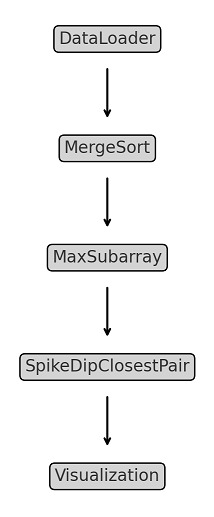
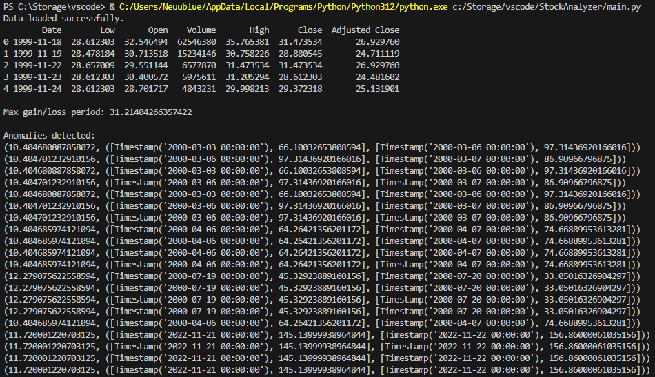
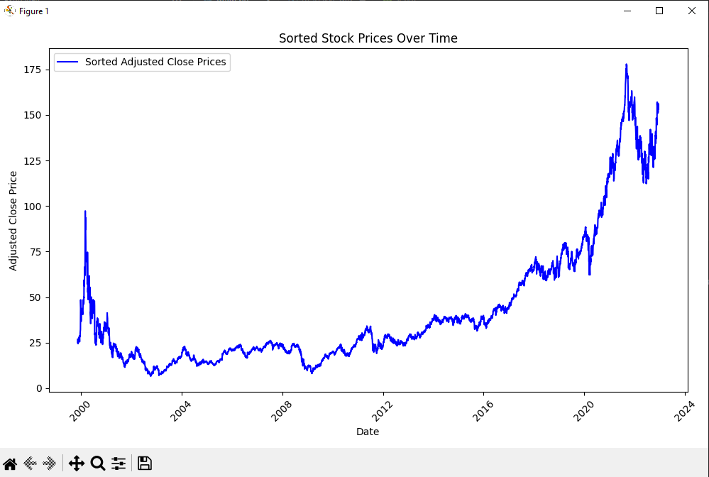
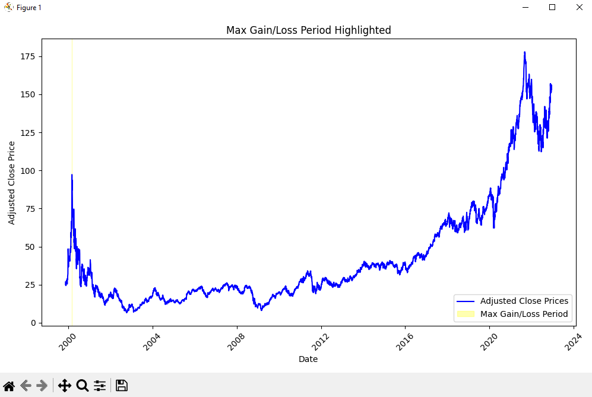

# StockAnalyzer Project

## Overview

**StockAnalyzer** is a Python project designed to analyze financial data, specifically stock prices, by sorting the data, identifying periods of maximum gain or loss, and detecting significant anomalies such as price spikes or dips. The project aims to assist investors and analysts in making informed decisions based on historical trends and anomalies in stock data.

### Problem Addressed

Investors often face challenges in identifying patterns and anomalies in stock price data, which can impact their trading strategies. This project addresses these challenges by providing tools to analyze and visualize financial datasets.

### Type-Specific Considerations

This project leverages historical stock price datasets, typically in CSV format, which include essential columns such as `Date` and `Adjusted Close`. The algorithms implemented for processing and analysis include:

- **Merge Sort**: Efficiently sorts the datasets.
- **Kadane’s Algorithm**: Identifies periods of maximum gain or loss in stock prices.
- **Closest Pair of Points**: Detects significant anomalies in stock price movements.

## Project Structure

```
StockAnalyzer/
├── data/               # CSV files for financial data
├── images/               # Images for the README.md file
├── main.py             # Main script with all the analysis logic
└── README.md           # Project documentation
```

### Overall Structure and Flow

Below is a flowchart illustrating the overall structure of the implementation:



#### Class Summaries

1. **DataLoader**
   - **Purpose**: Loads stock data from CSV files and processes it for further analysis.
   - **Key Methods**: 
     - `load_data(filepath)`: Loads data from a specified CSV file.
     - `prepare_data()`: Cleans and organizes the data for analysis.

2. **MergeSort**
   - **Purpose**: Sorts the stock prices by date using the Merge Sort algorithm.
   - **Key Methods**:
     - `sort(data)`: Sorts the provided dataset.

3. **MaxSubarray**
   - **Purpose**: Detects periods of maximum gain or loss using Kadane’s Algorithm.
   - **Key Methods**:
     - `find_max_gain_loss(data)`: Returns the maximum gain/loss period.

4. **SpikeDipClosestPair**
   - **Purpose**: Detects significant anomalies in stock prices.
   - **Key Methods**:
     - `detect_anomalies(data)`: Identifies anomalies based on defined thresholds.

5. **Visualization**
   - **Purpose**: Generates graphs to visualize sorted data, gain/loss periods, and detected anomalies.
   - **Key Methods**:
     - `plot_data(data)`: Displays the provided dataset as a graph.

## Setup Instructions

### Requirements

- Python 3.x
- Libraries: `pandas`, `matplotlib`, `numpy`

### Installation

1. Clone the repository:
   ```bash
   git clone https://github.com/Neuublue/StockAnalyzer.git
   ```

2. Navigate to the project directory:
   ```bash
   cd StockAnalyzer
   ```

3. Install the required Python libraries:
   ```bash
   pip install pandas matplotlib numpy
   ```

### Running the Project

1. Place your CSV stock data files inside the `data/` directory.
2. Run the main script:
   ```bash
   python main.py
   ```

## Verification of Code Functionality

### Example Code Execution

Below are screenshots demonstrating the system in action:

- **Loading Data**:


- **Sorted Data**:


- **Maximum Gain/Loss Period**:


- **Anomaly Detection**:


### Sample Scenarios

1. **Analyzing Stock Prices**: Load a CSV file with historical stock prices to visualize trends.
2. **Detecting Anomalies**: The program can identify sudden spikes or dips in prices that warrant further investigation.
3. **Generating Trend Reports**: Analyze periods of maximum gain or loss to aid investment decisions.

## Discussion of Findings

### Insights Gained

The analysis of the stock data provided valuable insights into market trends and behaviors. Key findings include:

- **Maximum Gain/Loss Trends**: Identifying periods with the highest gains or losses helps investors make informed decisions about buying or selling assets.
- **Anomalous Events**: Detection of significant price spikes and dips correlates with market events, indicating a direct impact of news and economic factors on stock behavior.
- **Time-Series Patterns**: Sorted data visualizations allow for the identification of seasonal trends and cyclic behaviors in stock prices.

### Challenges Faced

- **Accuracy of Anomaly Detection**: Ensuring the algorithms accurately identified significant price changes without being affected by normal market fluctuations was challenging.
- **Handling Missing Data**: Managing and preprocessing missing or incomplete data in the CSV files required additional effort for robust analysis.

### Limitations

- **Data Format Restrictions**: The system currently supports only CSV files with specific column formats, such as 'Date' and 'Adjusted Close'.
- **Basic Anomaly Detection**: The implemented detection techniques may lead to false positives or missed anomalies in complex datasets.

### Suggestions for Improvement

To enhance the functionality and usability of the StockAnalyzer project, consider the following improvements:

- **Expand Data Format Support**: Incorporate support for other data formats, such as JSON or XML, to accommodate a wider range of data sources.
- **Enhanced Visualization**: Improve visualization capabilities by integrating more interactive graphs for data exploration.
- **Integrate Machine Learning Models**: Implement machine learning algorithms to predict future stock price movements based on historical data patterns, providing users with predictive analytics tools.
